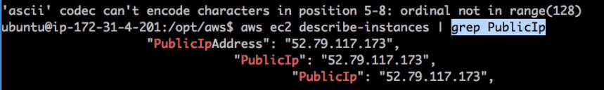

## EC2

> 가장 먼저 생겨난 범용적인 서비스
>
> 독립된 컴퓨터 한개를 통째로 임대해주는 서비스

#### Instance

컴퓨터 1대 = Instance 1개

- 인스턴스 생성

  - STEP 1.  Chosse an Amazon Machin Image(AMI) : **운영체제** 선택

    

    - Linux / Window
      - window 중 sql server가 설치되어있으면 무료가 아님 <= MS의 DB가격이 높음

  - STEP 2. Choose an Instance Type : 임대할 컴퓨터의 **사양** 선택

    

    - Free tier eligible 만이 1년동안 무료로 사용가능
    - Type 성능: nano<micro<small..순
    - vCPUs : 몇 개의 cpu가 달려있는가/여기서 v는 vritual 
      - 1이면 단위 CPU 하나가짐. 2이면 2개(상대적인 측면이 강함)
    - Family로 용도 구분 - 자신의 환경에 따라서 적합한 instance환경 선택

  - STEP 3. Configure Instance Details

    

    - 인스터스 개수, 스팟인스턴스, 네트워크 관련, 운영체제에서 shotdown했을 때,  실제로 인스턴스 삭제방지, 모니터링 설정

  - STEP4. Add Storage : EBS(Elestic) 장착

    

    - Size 30G까지 무료 / Volume Type 저장장치 형식 / IOPS 저장장치 속도 / Delete on Termination 인스턴스 삭제시 같이 저장장치 폐기할것인가(내장하드or외장하드)

  - STEP 5. Add Tags

    

    - Tag : 인스턴스 생성시 그 인스턴스가 어떤 역할인지, 누가 관리하는지등을 기록 

  - STEP6. Configure Security Group : 보안관련 설정

    - 인스턴스에 접근하는 권한 항목 설정, (누구 허용? 어떤 방식으로 접근 허용?) 일종의 방화벽

      

    - Create a new security group 시큐리티 그룹생성 -> 이름 설정 , 설명달기 

    - Type : 인스턴스에 접속하는 여러가지 방법중(http, https, ftp 등) 제한된 방법만 네트워크를 통해서 접속을 허용하는 정책을 설정하는 것

      - SSH : 만들고 있는 인스턴스가 리눅스, 유닉스 계열이라면 내 컴퓨터에서 서버 컴퓨터 접속시 원격제어를 해야함, 이 떄 리눅스계열을 원격제어하는 방법

    - Source : 모든 SSH의 접속을 허용 -> anywhere  / 내가 지정한 곳만 접속할 수 있도록 제한 -> My IP

    - HTTP + My IP?

      - IP에 해당되는 곳에서만 웹서버에 접속할 수 있는 상황

## 가격정책

[Amazon EC2 요금](https://aws.amazon.com/ko/ec2/pricing/)

- 온 디맨드 인스턴스
  - 운영체제 / region 별로 가격정책이 다름
  - 필요할 때 켰다가 끌 수 있다
- 예약 인스턴스
  - 회원권 구매와 비슷
  - 켜고 끄고 나올 때 회원권을 사서 좀더 저렴하게 이용가능
- 스팟 인스턴스
  - 필요할 때 끄고 킬 수 있다 -> 엄청난 컴퓨터들을 아마존이 보유하고 있다. -> <u>노는 컴퓨터</u>가 있다.
    - 노는 컴퓨터가 많으면 아주 저렴하게 인스터스를 사용할 수도 있음. 

    - 인스턴스 가격이 주가처럼 가변적인 성격을 가짐

      ​

## AWS를 제어하는 방법들

#### Management console

- AWS홈페이지 들어가서 제어 => GUI방식
  - **장점** : 익숙하다! 이해하기쉽다!

1. CLI (Command Line Interface)
   - e.g. `aws ec2 describe-instances` => GUI에서 Instance 목록 보는것과 똑같음.
   - 비유하자면) 자동차 네비게이션 터치터치터치 vs "성수동에 데려가줘(Command)"
   - `aws ec2 describe-instances|grep PublicIp`
     - 
   - **장점**: 자동화할 수 있다.
2. SDK(Softwear Development Kit)
   - php, python, c, java .. 등 언어의 역할 
     - 컴퓨터가 제공하는 기본적인 명령(파일 입축력, 데이터 전송 등)에서 반복적, 기계적으로 실행하는 어떠한 명령이있다면 컴퓨터 프로그래밍 언어를 통해 명령어들이 실행되는 순서를 언어의 문법에 따라서 정의한 후에 거기다 이름을 붙이면 프로그램, 또는 어플리케이션을 만든 것.
   - 컴퓨터 프로그래밍 언어를 통해 AWS를 제어할 수 있게 하는 도구
     - 각각의 언어별로 다른 버전의 명령어 SET을 제공
3. API(Application Programming interface)
   - sdk랑 구분이 잘 되진 않음.
   - restful API 웹을 통해 AWS의 인프라를 제어하는 수단
     - e.g. http://ec2.amazonaws.com/?Action=DescribeInstance
       - => 가지고 있는 정보를 xml로 출력해줌
     - aws에서 사용자에게 제공하는 가장 기초적이고 원시적인 방식 -> 가장 자유도가 높은 공통의 방식
     - 이 api를 이용하는 각각의 언어버전을 제공 -> SDK, CLI, GUI