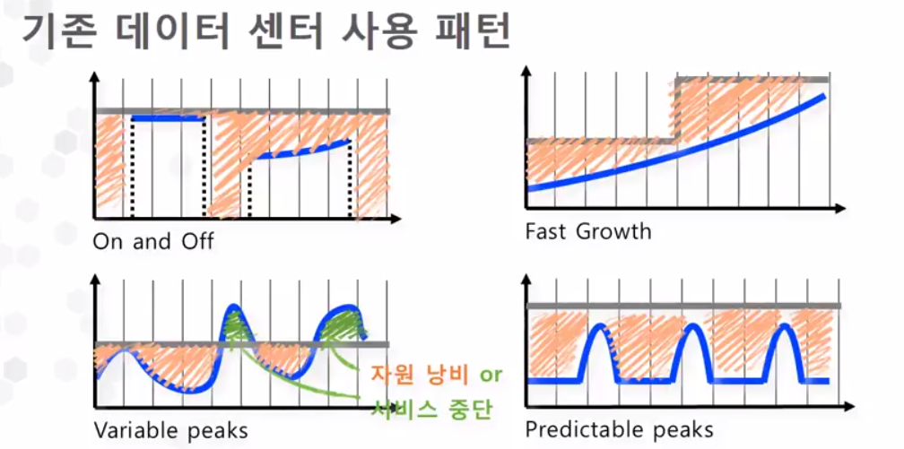
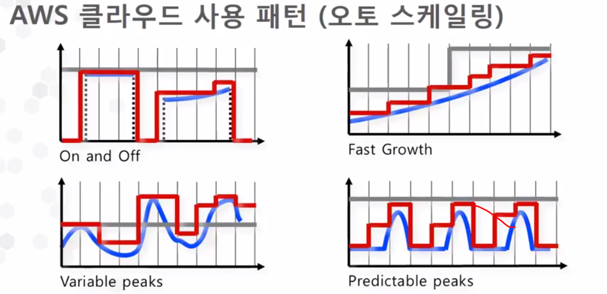
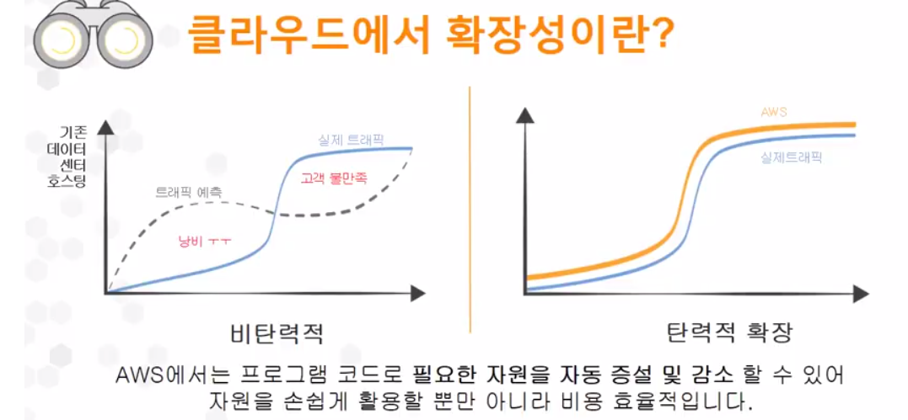
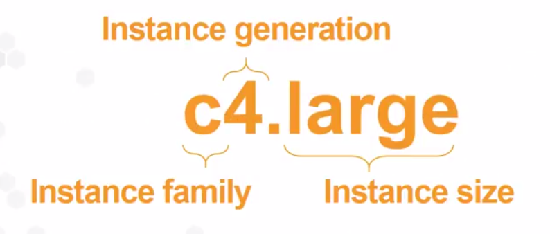
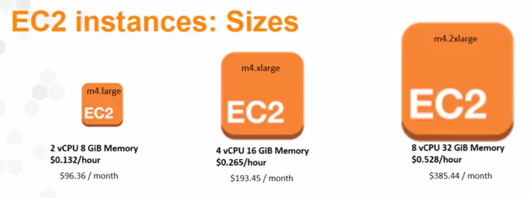
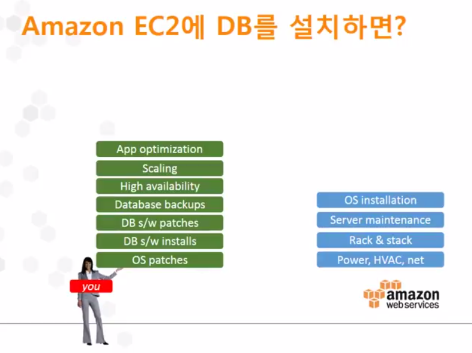
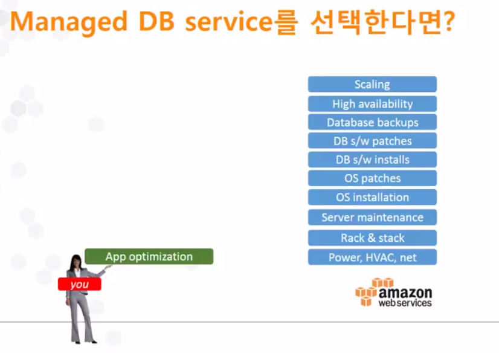

## 아마존 웹서비스와 클라우드 컴퓨팅

> 클라우드 = 구름 = 인터넷 (핵심적인 아이디어)
>
> **인터넷에 연결**되어있는 **거대한 컴퓨터**를 사용한다!

**e.g. 클라우드 컴퓨팅? 클라우드 컴퓨터로 할 수 있는 일?**

내 컴퓨터로 처리하기 힘든 방대한 데이터를

<u>인터넷</u>으로 연결되어 있는

<u>**강력하고 거대한 컴퓨터를 통해**</u> 해결하고

<u>인터넷</u>을 통해 받음

=> 클라우드 컴퓨팅을 단순 소비자가아닌 **<u>생산자로서</u>** 잘 이용하자!

- 클라우드 컴퓨팅이란?

  - 인터넷을 통해(물리적 서버와 네트워크 같은) IT 리소스와 (데이터 분석과 같은)어플리케이션을 원할 때 언제든지(On-demand) 사용한 만큼만 요금을 내는 서비스
  - 서버를 소유, 대여를 했던 개념에서 -> 몇 번은 클릭과 간단한 명령만으로 IT자원을 언제 어디서나 바로 사용할 수 있다!
    - CPU, 메모리, 스토리지, 네트워크, 데이터베이스 ...

- 이점

  - 초기 선 투자 불필요
    - 서비스 규모를 예측하고 미리 서버를 구매하고 관리할 필요가 없다
  - 저렴한 종량제 가격
    - 사용한 만큼 지불하는 종량제와 함께 규모의 경제로 인한 지속적인 비용 절감이 가능
    - 
    - 
  - 탄력적인 운영 및 확장 가능
    - 필요한 용량을 예측할 필요없이 트래픽 만큼만 사용하거나 손쉽게 확장할 수 있음
    - 
  - 속도와 민첩성
    - 시장 상황에 빠르게 대응할 수 있는 민첩성을 통해 비즈니스를 혁신할 수 있다
    - 인프라 준비를 위해 수 주일 소요 -> 수 분 소요
  - 비즈니스에만 집중 가능
    - 차별화된 서비스를 개발할 수 있는 다양하고 많은 실험을 할 수 있음
    - 실패의 비용이 높고 혁신 속도가 느려짐 -> 출발점의 비용이 낮음, 실패비용도 (진입장벽에 낮다)
  - 손 쉬운 글로벌 진출
    - 빠른 시간내에 손쉽게 글로벌 고객을 위한 서비스를 시작 가능

- 클라우드 컴퓨팅을 이용해 성공한 사례

  - 

- CDN - 한국 3개의 엣지

- 어떤 서비스가 있나?

  > AWS 활용  = Building Block 조립
  >
  > 비즈니스 요구 사항에 맞는 90여개 이상의 서비스 조립을 통해 유연한 활용 가능

  - 컴퓨팅(Compute Service)

    - EC2
      - Virtual Machine 
      - 재구성이 가능한 컴퓨팅 파워
      - 쉽게 확장/축소되는 컴퓨팅 용량
      - 
      - family:목적 / 4:세대/ large:크기
      - 사이즈
        - 
    - Auto Scailing
      - 어플리케이션의 고가용성 유지
      - 자동으로 EC2 Scail in & Out
      - 사용자의 지정에 따른 작동
      - 기능 자체는 무료 & 늘어난 서버자원에 대한 과금청구
    - Elastic Load Balancing
      - 기존에 사용하던 load balancer사용하는 것과 같음

  - 스토리지

    - S3
      - 정적파일을 보관할 수 있음
      - Secure, durable, highly-scalable
      - 9가11개 %
      - 사용한만큼만 지불
    - Glacier
      - S3와 형태는 같지만, 필요하지만 엑세스는 자주 하지 않는 파일 저장하는 저장소
      - 백업용도의 Cloud 데이터 -> S3 1/5 비용/ 엑세스하는데 시간이 오래걸림
    - EBS
      - 가상 서버와 논리적으로 마운트가 돼서 직접적으로 사용하는 서비스 
      - HDD/SDD와 비슷 
      - 하나의 EC2에 여러대의 EBS가능
      - 할당한만큼 비용 청구 

  - 데이터베이스

    

    

    - RDS = full managed service
      - 자동 스냅샷 + 트랜젝션 로그를 S3에 저장 -> 바로 롤백 /복원 가능
      - 스냅샷을 다른 지역으로 복제 가능
        - 복제된 스냅샷을 기반으로 데이터베이스 생성
    - DynamoDB
      - 데이터에 대한 읽기/쓰기에 대해 설정해서 과금되는 방식, 미리 설정해 둘 필요가 없음
    - ElastiCache
      - 작은용량, 잦은 접근을 유발하는 데이터에 적합
      - 자연스럽게 DB부하 분산

​	