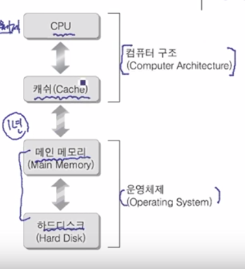

## 컴퓨터 구조

#### 시스템 프로그래밍이란?

- 시스템(컴퓨터 시스템)의 범위

  

  - **하드웨어 + 운영체제** 
  - e.g. A시스템 = 하드웨어 intel + 운영체제 window

- 시스템 프로그래밍

  - 소프트웨어 개발. 
  - 중요한 것! 모든 응용프로그램에서는 시스템 프로그래밍이 항상 포함되어 있다 -> 운영체제 자체의 기능을 십분 활용하는 프로그래밍. 

- 응용 소프트웨어 개발과의 차이점

  - 시스템 프로그래밍은 모든 응용 프로그램에 포함되는 요소

#### 컴퓨터 시스템(하드웨어 + 운영체제)의 주요 구성요소

- CPU, 캐쉬 (컴퓨터 구조)
  - 하드웨어 구조
    - CPU
      - 중앙처리 장치
      - 연산이 이뤄지는 원리
- 운영체제
  - 메인 메모리 ==> 프로그램이 어떻게 실행이 되는가
    - 램(RAM)
    - 프로그램의 실행에 연산원리(CPU)가 포함됨
    - 프로그램 실행 방식을 이해하는것
  - 하드디스크(I/O 입력과 출력에 관한)

#### CPU에 대한 이해

- e.g 덧셈을 하는 프로그램 2+5
- 
- ALU(Arthmetic Logic Unit)
  - 실질적으로 연산을하는 요소
  - => 2와 5
- 컨트롤 유닛
  - CPU전체를 총괄해서 신호를 주는 요소
  - 덧셈이 들어감(바이너리 코드) -> 명령을 해석하는 역할
  - Brain! ALU한테 실제로 덧샘을 해라는 역할 (해석해서 CPU의 행동을 결정)
- 레지스터
  - 마치 단기기억 같은 , CPU에 막 집어넣을 수 없으니 우선 덧셈, 2, 3 등을 버스인터페이스를 통해서 들어감.
  - 덧셈결과를 다시 레지스터에 저장
- 버스 인터페이스
  - 통식규약을 이해하고 그 규약에 따라 데이터를 주고받는 장치
  - 외부 장치(데이터를 주고 받는 입출력 장치) 네트워크 카드, 모니터, 키보드 등에도 버스 인터페이스가 포함되어있음
  - 통역사 역할인가?

인간의 인지과정과 비슷한 것 같다.

입출력 장치는 지각장치(눈, 코, 입 등 정보를 입력)

레지스터 --  단기 기억 장치에 저장해두고 컨트롤유닛(뇌!)에서 해석해서 ALU(행동)에서 직접 실행? 하고 그것을 다시 레지스터에 기억하고. 

#### 클럭 신호(Clock Pluse) When!!!

맥박..?

- 동작 타이밍을 결정
  - 모든 하드웨어의 요소들이 클럭 싸이클이 다름 
  - 클럭이 높아지면 열 발생 -> 시스템이 불안해짐
    - 오버 클럭킹 -> 빨라지지만 cpu탄다!
- 필요성
  - 요소들의 동기화
  - 중앙에서 일률적으로 클럭 신호를 발생. (장치중 가장 낮은 클럭 싸이클 수로)

