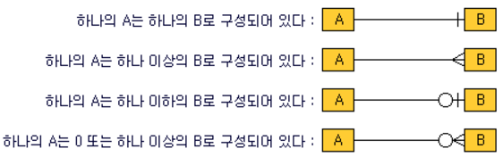

### Django stuydy week3

#### get and post

- get 은 갖고와서 읽는것 -> **불변성** (예를 들어 우편번호 처럼 바뀌지 않는게 기본)
- get & post 포함 방식이 기본적으로 7가지가 있음
- get은 file upload가 불가(브라우저마다 get방식이 다르게 작동하기 때문)

#### Apache and Nginx

- 웹 서버의 역할

  - 정해진 양식에 따라 클라이언트가 요청하는 것에 응대해줌. (매장 아줌마같은 역할)
  - e.g. http 200 제대로 전송이 되었다. 뭔지 모르지만. / http 404 /http 500 서버사이드 쪽에 멘붕이왔다(개발자가 서버쪽 잘 못 짠 것) / http403 접근권한 없음 
  - 대표적인 웹서버
    - Apache (기존 강자)
      - A패치(옷 기우는 것) : "패치덩어리다?" "인디언 부족이다?"
    - Nginx (신흥 강자)

- CGI(Common Gateway Interface) 공용 게이트웨이 인터페이스 

  - 웹이 생기기전 C나 per로 짠 프로그램 
  - (포토샵을 예로들어)
  - 하드디스크의 용량을 차지 => 트래픽이 높아져서 프로그램이 백번 호출?? => 메모리가 꽉찬다
  - solution
    - 프로세스 뜰 때마다 반복되는 코드가 많다. 함수등 공통된 부분은 한번에 띄우고, 사용하는 변수정도만 새로 처리하도록. => 메모리 확연히 줄어듬 => **쓰레드**방식

  - 가상메모리? 
    - 하드디스크 일부에다가 현재 실행하지 않는 프로그램을 복사해놓고 비우고 현재 요청한 프로그램을 돌림
    - 버버벅되는 이유? 하드디스크로 복사하고 불러오고 있기 때문
    - SSD가 좋은이유?  복사하고 불러오는 이유가 훨씬 더 빠름
    - 메모리 꽉차면 그냥 뻗어버림. Hang걸린다 "뻑났다."

- CGI => 쓰레드 방식 "Apache"

  - Prefork 

    - fork : 복사한다

    - **한 자식프로세스당 하나의 쓰레드**를 사용하는 방법

      기본 사용 메모리가 worker보다 높으며 프로세스 간 메모리를 공유하지 않는 독립 형태이므로 안정적임.

      아파치 컴파일시 옵션 추가하지 않을경우 기본으로 이 모듈로 동작합니다.

    - CGI 는 요청하면 프로세스 실행/ Apache는 미리 실행시켜둠(가게가면 점원들이 대기하고 잇는것처럼) "요청오면 니가해, 하고 왔으면 대기해"

    - 상황에 따라 쓰레드를 늘렸다 줄였다 알아서 동작 -> 훨씬 유연하게 많은 프로세스를 처리

    - php asp jsp 가 뜬 이유? 쓰레드 방식 

  - 웹서버 동작방식

    - index.html -> Apache "하드디스크야 index.html있니?" 있으면 던져줌 http200 == 있니?없어!있어!처리 
    - index.php 가오면 Apache 가 찾아. 확장자가 php네? (PHP Parcer)아파치가 너 이거 해석할 수 있지? 해석해 -> 다시 apache에게 (결국 django와 비슷 --> view가 하는 일인둡?)
    - my sql 은 php parcer가 mysql에게 주고 
    - php asp jsp는 결국 그냥 html로 만들어 주는 녀석들
      - jsp는 조금 다름? tomcat(ap서버)같은 것들을 더 거침
      - => 쓰리티어 
    - apache많이 쓰는 이유? php랑 궁합이 너무 좋음

  - 쓰레드 기반의 장점?

    - 메모리 부족하다? cpu늘리면 됨
      - cpu 비유하자면) 싱글코어 사람1명 쿼드코어 사람4명
    - => 병렬처리 프로그래밍

- 쓰레드 시대가 오래가다가  얘도 메모리 야금야금차지하다가 뻗어버리는건 매한가지 -> event-driven "node.js"

  - 비유하자면 Apache 은행창구 방식, 사람들이 줄 서 잇음
  - event-driven은 처리하는 사람 한명 밖에 없어. 근데 번호표가 있어서 사람들이오면 번호표를 떼어가서 사람들은 자기할 일 하다가 부르면 찾아가면됨. 
  - => **비동기 방식** 언제해줄지 모르지만 해줄게. 동기는 해 줄 때까지 딴 일을 못함. 
    - **동기방식**은 **전화**과 비유됨. 전화받으면서 딴 짓못하고 딴 사람이랑 통화 못함
    - **비동기 방식**은 **문자**, 얘가 3초내에 답장이 올거야라고 가늠하진 못하지만, 딴짓하다가 답변오면 확인
    - jsp가 확장하기 더 쉬움
      - "확장한다." 는 개념
        - 하드웨어 성능을 올리다가 너무 비용이 많이 듬. 그러면 싼 거 똑같은거 여러개 컴퓨터를 역할을 분리 (수평적으로 늘림)
        - 공유기 같네!
    - 각자 언어마다 비동기방식을 지원하는 프레임워크들이 다 있음.
    - 동접자를 시뮬레이션 해주는 프로그램. -> 클라이언트 설정하고, 공격도 할 수 있음.  **JMeter**

#### Poll app 만들기

- ERD

  - 

- result.html

  - `vote{{ choice.votes|pluralize }}` pluralize : 1개이상이면 s붙여줌

- polls : urls.py

  - `app_name = 'polls'`  html에서 url poll:name명으로 접근가능
    - ``

- polls : views.py

  - `HttpResponseRedirect(reverse('polls:result', args=(question_id,)))`  
  - reverse 
    - `return HttpResponseRedirect(reverse('url_name'))`

- detail.html

  - `choice{{ forloop.counter }}`

    - | VariableVariable      | Description                              |
      | --------------------- | ---------------------------------------- |
      | `forloop.counter`     | The current iteration of the loop (1-indexed) |
      | `forloop.counter0`    | The current iteration of the loop (0-indexed) |
      | `forloop.revcounter`  | The number of iterations from the end of the loop (1-indexed) |
      | `forloop.revcounter0` | The number of iterations from the end of the loop (0-indexed) |
      | `forloop.first`       | True if this is the first time through the loop |
      | `forloop.last`        | True if this is the last time through the loop |
      | `forloop.parentloop`  | For nested loops, this is the loop surrounding the current one |