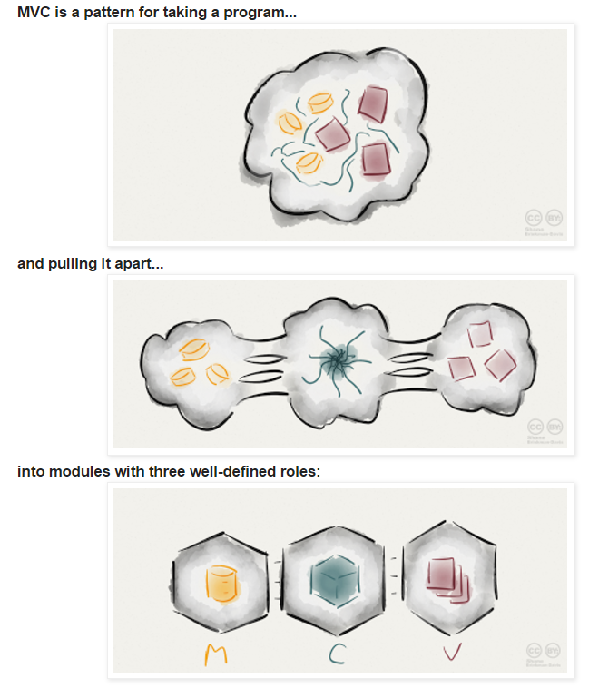

## Django 개념

[mvc개념](http://www.essenceandartifact.com/2012/12/the-essence-of-mvc.html)

#### django 구성

****

- **녹색 파일**이 실질적으로 우리가 다루게 될 파일
- 미들웨어(Middleware) : 느낄수없지만 django 뒤에서 다양한 처리
- 처리과정
  - 브라우저 요청 => **WSGI**로 신호가 들어옴
    - WSGI(Web Server **Gateway** Interface)
    - 웹서버와 django를 적절하게 결합시키는 역할 
  - => urls.py 
    - 정규표현식으로 구성 
  - => 특정한 View로 보냄
    - <=> models.py
      - <=> Database
        - sql문 다루기가 어렵는데 django는 model에서 그 과정을 매우 쉽게 결합해줌 (MANAGERS가 처리)
  - => TEMPLATE

#### Settings.py

- DEBUG
  - 디버그 모드 설정
- INSTALLED_APPS
  - pip로 설치한 앱 또는 본인이 만든 app을 추가
- MIDDELWARE_CLASSES
  - request와 response 사이의 주요 기능 레이어
- TEMPLATES
  - django template관련 설정, 실제 뷰(html, 변수)
- DATABASES
  - 데이터베이스 엔진의 연결 설정
- STATIC_URL
  - 정적 파일의 URL(css, javascript, image, etc.)

#### manage.py

- 프로젝트 관리 명령어 모음

- ****

- ****

- ****

  ​

- 주요 명령어
  - startapp - 앱 생성
  - runserver - 서버 실행
  - createsuperuser - 관리자 생성
  - makemigrations app - app의 모델 변경 사항 체크
  - migrate - 변경 사항을 DB에 반영
  - shell - 쉘을 통해 데이터를 확인
  - collectstatic - static파일을 한 곳에 모음
- ex)./manage.py runserver 0.0.0.0:8080

