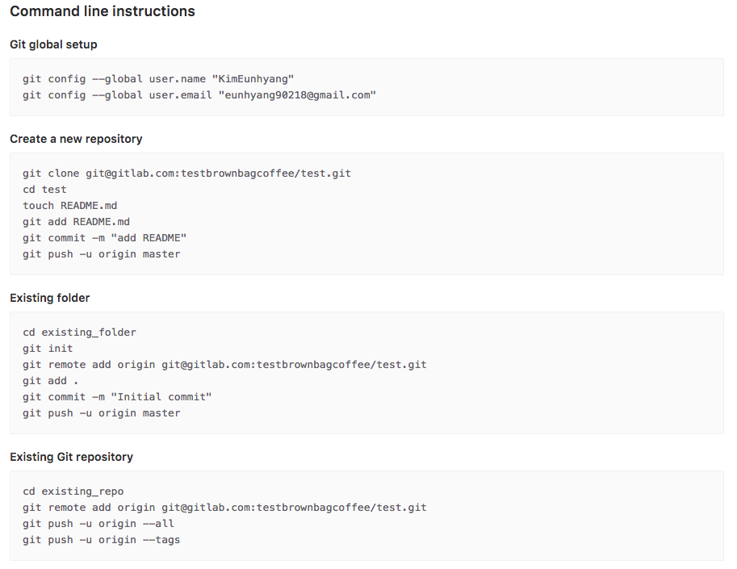

## Gitlab introduction

> Git의 원격 저장소 역할 
>
> github의 설치형을 목적으로 만들어짐

- 특징

  - 설치형 버전관리 시스템

- issue tracker

  - 업무(이슈)를 추적 및 관리

- project 관리

  - ssh/https
    - git에 접근하는 방식
    - ssh를 권장

- project 생성 및 local 연동

  

  - git global setup
    - 자신이 누구인가를 setting
    - 누가 push 했나 확인할 수 있도록
  - Esisting Git repository
    - 이미 local에 기존 저장소가 있는경우 -> 기존 저장소를 gitlab에 등록
  -  Gitlab 서버 설치
    - terminal 
      - `$ ssh-keygen` : ssh 비밀키+공개키 생성
        - 생성한 공개키를 gitlab에 등록해야함
          - -> 해당경로에 생성됨
          - 보안을 위한 비밀번호 생성하지 않으면 enter
        - 키 생성 완료
          - `id_rsa` 비밀키 
          - `id_rsa.pub` 공개키
      - `cat id_rsa.pub`
        - 명령어 치면 나오는 내용 copy
    - gitlab : User setting의 ssh key에 등록
      - -> <u>작업 컴퓨터</u>에 ssh <u>비밀키</u>가 저장되어 있고 **+** <u>gitlab</u>에 <u>공개키</u>가 저장되어있으면 **<u>gitlab의 원격저장소에 접근할 수 있는 권한</u>**을 얻게 된 것
    - terminal
      - `git config --global user.name "KimEunhyang"`
        - 내가 지금부터 git을 이용하면서 하는 작업에 사용자 이름으로 "KimEunhyang"을 쓰겠다
      - git config --global user.email "eunhyang90218@gmail.com"  
        - 내 식별자를 등록
      - Create a new rository 외 2개 중 선택 후 진행
        - git push 때 gitlab에 저장된 key와 local의 key비교

- Issue

  - open된 상태
    - 현재 진행중이거나/ 이슈를 해결할 사람을 기다리는 일감
  - closed -> 완료되었다!
  - Assignee : 업무를 진행할 사람
  - Labels 생성: 개선사항(enhancement), 결함(bug), 적용대기, QA등
  - milestone 
    - 소프트웨어의 여러가지 목표 (e.g. 여러개의 하위 업무/ version1,2) 를 설정하고 얼마나 달성되었는지 파악
    - 할당된 이슈가 전부 open->closed되어야 closed가능
  - 이슈를 효과적으로 작성하기 -> markdown 